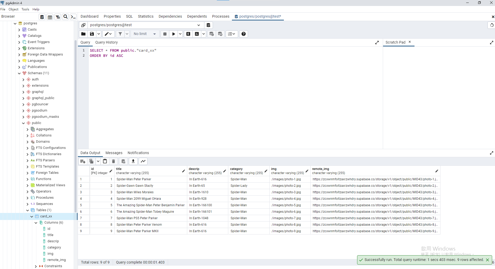
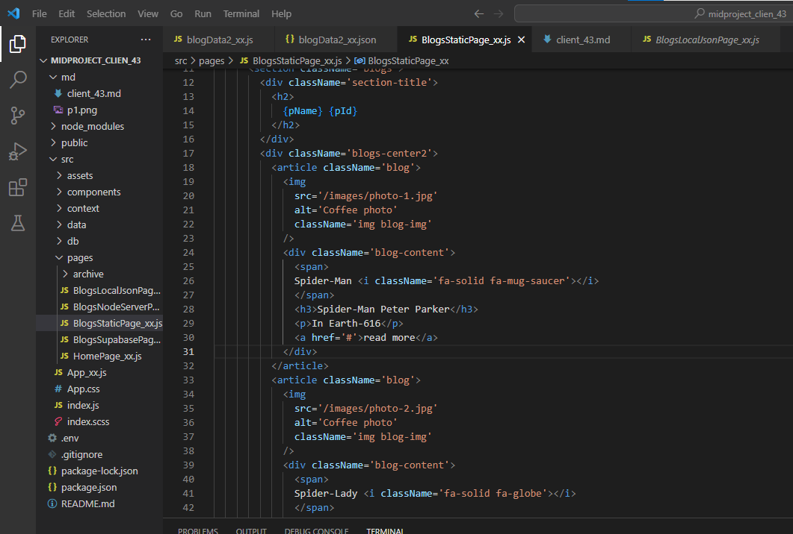
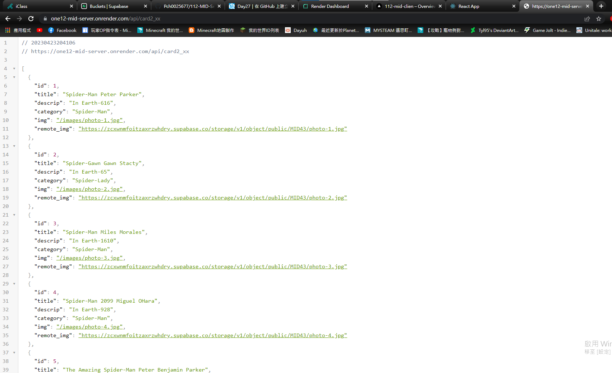
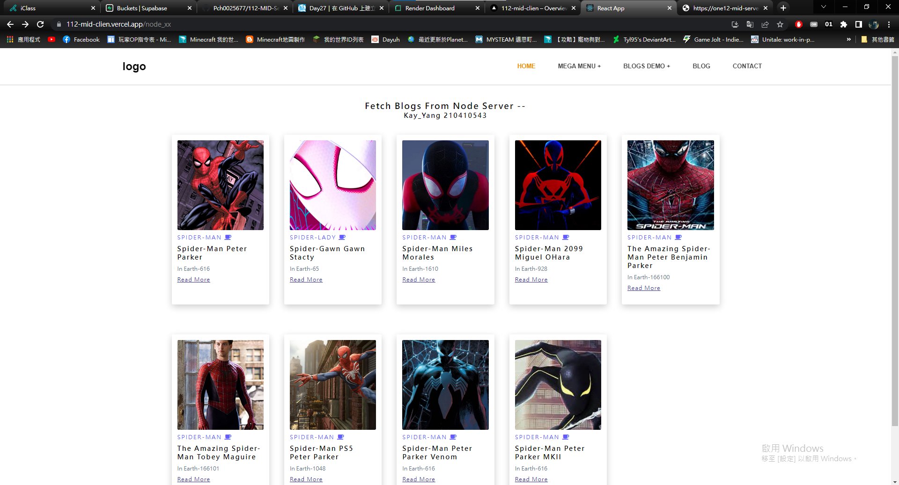
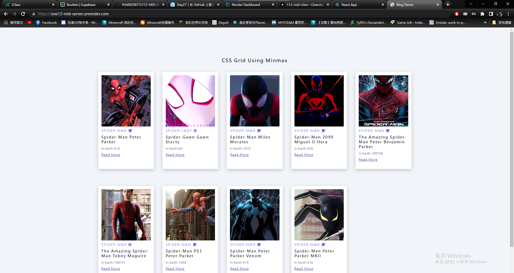

### 1. Server 端實作  (20%)
-- Node.js + PostgreSQL (Supabase)

-- 後台資料管理

-- 設計API，可透過 API，存取資料

-- Nodejs server ，可以直接在 render 雲端執行

### 2. 前端實作 (30%)
-- Serverless: React  + Supabase

-- Server: React + server api (from Node.js)

-- React code 要放在 Vercel 雲端，可以直接呼叫 Supabase 或  render 雲端

GITHUB:https://github.com/Pch0025677/112-MID-Clien
VERCEL:https://vercel.com/pch0025677/112-mid-clien
RENDER:https://one12-mid-server.onrender.com